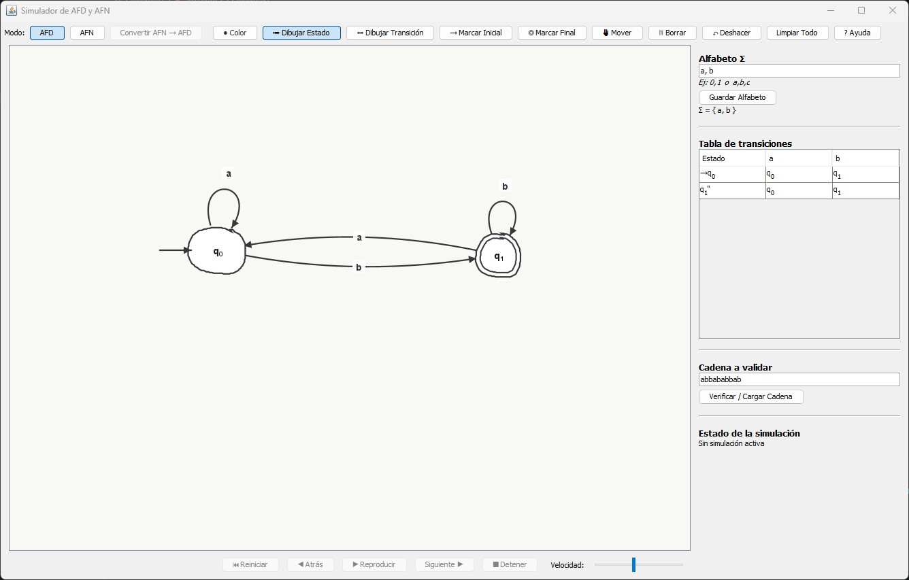
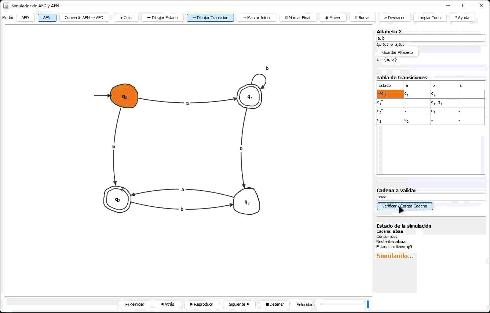

# Editor y Simulador de AFD (Java Swing)
# Simulador de AFD y AFN

Aplicación de escritorio hecha con Java Swing para **dibujar, editar y
simular autómatas finitos** directamente sobre un lienzo. Permite trabajar
con autómatas finitos deterministas (AFD) y no deterministas (AFN), observar
su tabla de transición y reproducir la lectura de una cadena paso a paso.

La aplicación no depende de JFLAP ni de otra biblioteca de autómatas: el
modelo, la simulación y la conversión AFN → AFD están implementados en el
proyecto.



## Características

- Dibujo libre de estados, transiciones y auto-transiciones.
- Estados iniciales y finales, renombrado y movimiento de nodos.
- Edición de color del trazo, deshacer y limpieza del autómata.
- Modo AFD con validación de conflictos de determinismo.
- Modo AFN con múltiples destinos para un símbolo y transiciones vacías
  (`ε`).
- Tabla de transiciones sincronizada con el autómata.
- Simulación manual o automática con controles de reproducción y velocidad.
- Resaltado del estado actual, las transiciones usadas y el resultado.
- Conversión de AFN a AFD mediante construcción de subconjuntos y cierre
  épsilon.

## Requisitos

- JDK 11 o superior.
- Terminal con `javac` y `java` disponibles en el `PATH`.

El proyecto actual se ejecuta correctamente con JDK 25. No necesita Maven,
Gradle ni dependencias externas.

## Compilar y ejecutar

Los comandos se ejecutan desde la raíz del repositorio, donde están `README.md`
y la carpeta `src/`.

### Linux, macOS o Git Bash

```bash
rm -rf out
mkdir -p out
javac -d out $(find src -name "*.java")
java -cp out afdpainter.Main
```

### Windows PowerShell

```powershell
Remove-Item -Recurse -Force out -ErrorAction SilentlyContinue
New-Item -ItemType Directory out | Out-Null
javac -d out (Get-ChildItem -Recurse -Filter *.java src).FullName
java -cp out afdpainter.Main
```

## Generar ejecutables para Windows

El workflow `.github/workflows/build-windows.yml` se ejecuta al hacer push a
`main` o manualmente desde la pestaña **Actions** de GitHub. Compila el
proyecto con JDK 21 y crea una **Release nueva** por cada ejecución exitosa.
Las Releases usan tags automáticos como `build-1`, `build-2`, etc., y contienen
dos archivos descargables:

- `SimuladorAFDADN-portable-windows.zip`: aplicación portable que incluye su
  propio `SimuladorAFDADN.exe` y no requiere instalar Java.
- `SimuladorAFDADN-1.0.<n>.exe`: instalador de Windows con acceso directo y
  entrada en el menú Inicio.

Para ejecutarlo manualmente, entra en **Actions**, selecciona **Build Windows
application** y pulsa **Run workflow**. Al terminar, la nueva Release aparecerá
en la pestaña **Releases** del repositorio.

La ventana principal se titula **Simulador de AFD y AFN**.

## Flujo rápido

1. Elige **AFD** o **AFN** en la barra superior. El modo AFD está seleccionado
   inicialmente.
2. En **Alfabeto Σ**, escribe símbolos separados por coma o espacios, por
   ejemplo `0,1` o `a b c`, y pulsa **Guardar Alfabeto**.
3. Selecciona **Dibujar Estado** y arrastra el mouse para dibujar cada estado.
   El primer estado creado se marca como inicial automáticamente.
4. Selecciona **Dibujar Transición**, arrastra desde el estado origen hasta el
   destino y escribe sus símbolos, por ejemplo `a,b`. Para un auto-loop,
   termina el trazo sobre el mismo estado.
5. Usa **Marcar Inicial** o **Marcar Final** y haz clic sobre un estado cuando
   necesites cambiar esas marcas.
6. En **Cadena a validar**, escribe la cadena y pulsa
   **Verificar / Cargar Cadena**.
7. Controla la ejecución desde la barra inferior: **Reiniciar**, **Atrás**,
   **Reproducir**, **Siguiente**, **Detener** y **Velocidad**.

Durante la simulación, el estado activo se muestra en naranja. Una cadena
aceptada termina con el autómata en verde; una cadena rechazada o sin camino
posible termina en rojo.



## AFD y AFN

### AFD

En un AFD, para un estado y un símbolo determinados solo puede existir un
destino. La aplicación avisa y evita crear una transición que rompa esa
restricción. La tabla lateral muestra una única salida por celda cuando está
definida.

### AFN

En un AFN, un mismo símbolo puede llevar a varios estados. Al crear una
transición aparece la opción **Transición vacía (ε / epsilon)**. Las
transiciones ε no consumen caracteres de la cadena y se tienen en cuenta al
calcular el cierre épsilon.


### Convertir AFN → AFD

1. Selecciona **AFN**, dibuja el autómata y define el alfabeto.
2. Asegúrate de tener un estado inicial.
3. Pulsa **Convertir AFN → AFD**.

Se abre una ventana nueva con el AFD equivalente. La interfaz incluye la
tabla de subconjuntos del AFN y la tabla de transiciones del AFD generado.


## Controles de edición

| Control | Función |
| --- | --- |
| **Dibujar Estado** | Crea un estado con el trazo realizado con el mouse. |
| **Dibujar Transición** | Crea una transición entre dos estados y solicita sus símbolos. |
| **Marcar Inicial** | Define el estado inicial; solo puede haber uno. |
| **Marcar Final** | Activa o desactiva el estado final. |
| **Mover** | Reubica un estado y ajusta sus transiciones. |
| **Borrar** | Elimina un estado o una transición. |
| **Color** | Cambia el color de los trazos nuevos. |
| **Deshacer** | Revierte la última creación de estado o transición. |
| **Limpiar Todo** | Borra el autómata después de pedir confirmación. |
| **Ayuda** | Abre las instrucciones dentro de la aplicación. |

También puedes hacer doble clic sobre un estado para cambiar su nombre.

## Estructura del proyecto

```text
src/afdpainter/
├── Main.java                         # Punto de entrada
├── model/
│   ├── Automaton.java                # Estados, transiciones, alfabeto y modo
│   ├── State.java                    # Estado y geometría del trazo
│   └── Transition.java               # Transiciones y geometría de arcos
├── sim/
│   ├── Simulator.java                # Simulación de AFD y AFN
│   └── NfaToDfaConverter.java        # Construcción de subconjuntos
└── gui/
    ├── MainFrame.java                # Ventana principal y flujo de uso
    ├── DrawingPanel.java             # Lienzo y edición con el mouse
    ├── ToolBar.java                  # Modos de edición y conversión
    ├── PlaybackBar.java              # Controles de simulación
    ├── TransitionTablePanel.java     # Tabla δ
    ├── SubsetTablePanel.java         # Tabla de subconjuntos
    ├── Labels.java                   # Textos de la interfaz
    └── Palette.java                  # Colores de la interfaz
```

## Notas de uso

- Cada símbolo del alfabeto debe tener exactamente un carácter. Las entradas
  con tokens de varios caracteres se ignoran al guardar el alfabeto.
- Antes de cargar una cadena debes guardar el alfabeto y tener un estado
  inicial.
- Cambiar entre AFD y AFN borra el autómata actual, pero la aplicación pide
  confirmación antes de hacerlo.
- El botón **Detener** termina la simulación activa; **Reiniciar** conserva la
  cadena y vuelve al primer paso.

## Licencia

No se ha incluido un archivo de licencia en este repositorio.
